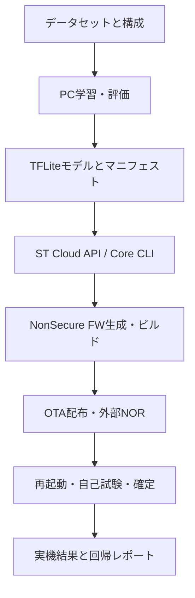

# STM32エッジAI 学習・コンパイル・OTA環境 調査・構築計画

- 対象ボード: B-U585I-IOT02A（STM32U585）
- 対象リポジトリ: [Fly0KUBOKI/B-U585I-IOT02A](https://github.com/Fly0KUBOKI/B-U585I-IOT02A)
- 調査日: 2026-08-22
- 文書状態: 初版・実装計画

## 1. 目的

次の3系統を、再現可能な1本のパイプラインとして構築する。

1. PC上でデータを管理し、機械学習モデルを学習・評価する。
2. 学習済みモデルをST Edge AIのAPIまたはCLIで解析・検証・STM32向けコードへ変換する。
3. 変換結果をSTM32ファームウェアへ組み込み、OTAで導入し、実機推論と回帰試験を自動実行する。

初期対象は音声イベント分類とする。オンデバイス学習は対象外であり、学習はPC、STM32は推論のみを担当する。

## 2. 結論と推奨方針

### 2.1 推奨する段階導入

| 段階 | 配布単位 | 推奨度 | 理由 |
|---|---|---:|---|
| 第1段階 | AIコードと重みを含むNonSecureファームウェア全体 | 必須 | 既存OTA方式を再利用でき、生成コード・ランタイム・重みの版ずれを防げる |
| 第2段階 | モデル専用パッケージ | 条件付き | ファームウェアABIと重み配置を固定できた後でなければ、安全な差し替えが難しい |

「学習済みデータ」は、そのままSTM32が実行できるファイルとは限らない。ST Edge AIが生成するネットワークコード、重み、ランタイムライブラリ、前処理条件は一体として互換性を管理する必要がある。したがって、最初は**NonSecureファームウェア全体をOTA**し、安定後にモデル単体OTAを追加する。

### 2.2 ツールの位置付け

- STM32Cube AI StudioはGUIでの解析・生成に利用できる。
- 自動化には、ST公式の **ST Edge AI Developer Cloud REST/Python API** を主経路とする。
- オフラインまたは障害時の代替として、ローカルの **ST Edge AI Core `stedgeai` CLI** を維持する。
- GUI操作の自動化は行わない。

### 2.3 推論配置

- MDF1、DMA、音声取得は現状どおりSecure側に保持する。
- 音声データは既存のSecure Gateway経由でNonSecure側へ渡す。
- AI推論、後処理、判定、テレメトリはNonSecure側へ移す。
- OTA適用後は直接ジャンプせず、システムリセット後に新イメージを起動する。

## 3. 調査結果

### 3.1 現行リポジトリ

現行実装には、次の試作パイプラインが存在する。

```text
train.py
  -> model.tflite
  -> stedgeai generate
  -> Secure/Core/AIへコピー
  -> STM32CubeIDEヘッドレスビルド
  -> ST-LINKまたはOTA
```

主な確認箇所:

- [MLパイプラインREADME](https://github.com/Fly0KUBOKI/B-U585I-IOT02A/blob/master/pc_side/ml_pipeline/README.md)
- [pipeline.py](https://github.com/Fly0KUBOKI/B-U585I-IOT02A/blob/master/pc_side/ml_pipeline/pipeline.py)
- [train.py](https://github.com/Fly0KUBOKI/B-U585I-IOT02A/blob/master/pc_side/ml_pipeline/train.py)
- [ai_app.cpp](https://github.com/Fly0KUBOKI/B-U585I-IOT02A/blob/master/Secure/Core/Src/ai_app.cpp)
- [OTA実装](https://github.com/Fly0KUBOKI/B-U585I-IOT02A/blob/master/Secure/Core/Src/ota.cpp)
- [PC側OTA送信](https://github.com/Fly0KUBOKI/B-U585I-IOT02A/blob/master/pc_side/status_monitor/ota_update.py)
- [TrustZoneリファクタリング計画](https://github.com/Fly0KUBOKI/B-U585I-IOT02A/blob/master/docs/TrustZone%20リファクタリング計画.md)

既に利用可能な要素:

- TensorFlowによる1D-CNN学習とTFLite出力
- `stedgeai generate` によるSTM32U5向けコード生成
- UART/TCP経由のチャンク転送、CRC確認、外部NORへのステージング
- Bank2のNonSecureイメージ更新、旧イメージのバックアップ、ロールバック用メタデータ
- Secure側音声取得とNonSecure側への音声バッファ公開

主要な不足・リスク:

| 項目 | 現状 | 対応 |
|---|---|---|
| データ分割 | 音声フレーム単位のランダム分割 | 録音ファイル・収録セッション単位に変更し、リークを防止 |
| サンプルレート | WAV読込時に厳密検証していない | 16 kHz/48 kHzを構成で固定し、異常入力を拒否または明示変換 |
| 量子化 | float TFLite | 代表データを用いたfull-int8量子化を基本とする |
| 評価 | validation中心 | 独立test、混同行列、クラス別指標、OOD評価を追加 |
| 再現性 | ツールパスと環境がPC依存 | lock、seed、構成、データハッシュ、ツール版を記録 |
| ST変換 | ローカル10.2系の固定パス | Cloud APIを追加し、ローカルCLIは設定化 |
| AI配置 | Secure側 | NonSecure側へ移動し、Secureはデバイス保護と音声取得を担当 |
| OTA成果物 | Secure ELF由来のbinを生成する可能性 | Bank2向けNonSecure binであることをビルド後に検証 |
| OTA適用 | 連続ホット適用でHardFaultの履歴 | 適用完了後は `NVIC_SystemReset()` を使用 |
| ブート確定 | 起動直後に確定 | AI初期化、既知入力試験、通信確認後に確定 |
| 完全性 | CRC16 | 転送誤り検出として維持し、成果物識別にはSHA-256を追加 |
| 真正性 | 署名なし | 製品化時は署名検証と鍵管理を別途必須化 |

### 3.2 ST公式環境

ST公式資料から、次を確認した。

- [ST Edge AI Core](https://www.st.com/en/development-tools/stedgeai-core.html) は、TensorFlow Lite、Keras、ONNXなどのモデルを解析し、STM32向けに最適化されたCコードへ変換するCLIを提供する。
- [ST Edge AI Developer Cloud](https://stm32ai.st.com/st-edge-ai-developer-cloud/) は、解析、検証、実機ベンチマーク、コード生成をREST APIから利用できる。
- [Developer Cloud Python API実装](https://github.com/STMicroelectronics/stm32ai-modelzoo-services/tree/main/common/stm32ai_dc) と[利用例](https://github.com/STMicroelectronics/stm32ai-modelzoo-services/tree/main/tutorials/scripts/stm32ai_dc_examples)が公開されている。
- 公式の[Audio Event Detection導入手順](https://github.com/STMicroelectronics/stm32ai-modelzoo-services/blob/main/audio_event_detection/docs/README_DEPLOYMENT.md)では、B-U585I-IOT02Aが対象ボードとしてサポートされ、STM32U5/GCC、ローカルまたはCloudでの生成が示されている。
- [学習手順](https://github.com/STMicroelectronics/stm32ai-modelzoo-services/blob/main/audio_event_detection/docs/README_TRAINING.md)と[量子化手順](https://github.com/STMicroelectronics/stm32ai-modelzoo-services/blob/main/audio_event_detection/docs/README_QUANTIZATION.md)では、YAML構成、データセットCSV、再現性設定、代表データによる量子化が扱われている。

Developer CloudのPythonラッパーでは、概ね次の処理を自動化できる。

```python
from common.stm32ai_dc import Stm32Ai, CloudBackend
from common.stm32ai_dc import CliParameters, CliLibrarySerie, CliLibraryIde

ai = Stm32Ai(CloudBackend(username, password, version=core_version))

analysis = ai.analyze(CliParameters(model=model_path))
validation = ai.validate(CliParameters(model=model_path))
benchmark = ai.benchmark(CliParameters(model=model_path), "B-U585I-IOT02A")
result = ai.generate(CliParameters(
    model=model_path,
    includeLibraryForSerie=CliLibrarySerie.STM32U5,
    includeLibraryForIde=CliLibraryIde.GCC,
    output=output_dir,
))
```

実装時はSTの当該バージョンの例に合わせて引数名と認証方式を再確認する。認証情報はOSの秘密情報ストア、CI secrets、または実行時環境変数から渡し、リポジトリ、設定ファイル、ログへ保存しない。

## 4. 目標アーキテクチャ



### 4.1 コンポーネント

| コンポーネント | 責務 | 主な出力 |
|---|---|---|
| Dataset Manager | 収録データ、ラベル、分割、ハッシュ管理 | dataset manifest CSV |
| Trainer | 前処理、学習、評価、量子化 | `.keras`、`.tflite`、評価JSON |
| ST Compiler Client | upload、analyze、validate、benchmark、generate | 生成C/H、ランタイム、解析JSON |
| Firmware Integrator | 生成物配置、ラベル・構成生成、互換性検査 | NonSecure ELF/bin、map |
| Artifact Packager | ハッシュ、版、対象、ABIを束ねる | OTA package + manifest |
| OTA Client | UART/TCP転送、再試行、適用、結果取得 | 転送ログ |
| Device Self-test | AI初期化、既知入力推論、実音声推論 | PASS/FAILテレメトリ |
| HIL Test Runner | 電源断、破損、連続更新、性能試験 | 回帰試験レポート |

## 5. PC機械学習システム

### 5.1 データ管理

1レコードを1録音ファイルとして、最低限次をmanifestに保持する。

```text
clip_id, path, label, split, source, session_id, device_id,
sample_rate, duration_ms, sha256, license
```

必須ルール:

- 同じ録音、話者、収録セッションから作った窓をtrain/validation/testへ跨がせない。
- 元データは不変とし、加工条件は構成ファイルで管理する。
- サンプルレート、チャンネル数、bit depth、破損を事前検証する。
- ラベル一覧と順序をモデル成果物に含め、ファームウェア側とハッシュで照合する。
- 実機マイクで収録したデータをtestセットへ含める。

### 5.2 前処理・モデル候補

| 候補 | 用途 | 利点 | 注意点 |
|---|---|---|---|
| 現行raw PCM 1D-CNN | パイプライン疎通 | 小規模で単純 | 精度・頑健性・公式例との比較が必要 |
| log-mel + MiniResNetV2 int8 | 音声イベント分類の本命 | ST公式AED構成と整合 | PCとSTM32の特徴量計算を厳密に一致させる必要 |

最初の評価では両方を同一testセットで比較する。公式AED構成を採用する場合、16 kHzまたは48 kHz、FFT長、窓長、hop、mel band、周波数範囲、正規化を単一YAMLからPC/STM32双方へ生成する。

### 5.3 学習・評価

実行単位ごとに次を保存する。

- Git commit、Python/ライブラリ版、乱数seed、OS/GPU情報
- データmanifestのSHA-256、学習構成、前処理構成
- 学習履歴、最良checkpoint、停止理由
- accuracy、macro-F1、クラス別precision/recall、混同行列
- floatモデルとint8モデルの差分
- 推論用known-answer input/output

量子化は代表データセットによるfull-int8を基本とする。量子化後のtest精度低下が2ポイントを超える場合は、代表データ、異常値、前処理、QATの順で調査し、基準変更はレビューを必要とする。

### 5.4 PC側成果物

```text
artifacts/<model_id>/<version>/
├── model.keras
├── model_int8.tflite
├── labels.json
├── preprocessing.json
├── training_config.yaml
├── metrics.json
├── confusion_matrix.png
├── known_answer_input.bin
├── known_answer_output.json
└── model_manifest.json
```

## 6. STM32向けコンパイルシステム

### 6.1 処理順序

1. TFLiteをローカルで構造検査する。
2. Developer Cloudへ一時アップロードする。
3. `analyze` でFlash、RAM、MACC、非対応演算を取得する。
4. `validate` でPC推論との数値差を確認する。
5. B-U585I-IOT02A実機で `benchmark` を実行する。
6. STM32U5/GCC向けに `generate` する。
7. 生成物、ST Edge AI Core版、ランタイム版を保存する。
8. Cloud上の一時モデルを削除する。
9. NonSecureプロジェクトへ統合してビルドする。

Cloud障害時だけ、同じモデルと固定版のローカル`stedgeai`で代替する。Cloud生成物とローカル生成物を同一ビルド内で混在させない。

### 6.2 バージョン互換性ゲート

現行プロジェクトにはST Edge AI 10.2系の名称を含むランタイムがある一方、現行Model Zoo Servicesは新しいST Edge AI Core系を使用する。名称や版体系だけで互換と判断せず、以下を1セットとして固定する。

- モデル形式とopset
- ST Edge AI Core版
- 生成C/H
- ランタイムライブラリ
- MCU series、toolchain、コンパイルオプション
- 生成時の解析レポート

版を更新する場合は、既知モデルの生成、ビルド、known-answer試験、実機性能を通してから採用する。

### 6.3 コンパイル合格条件

- 非対応演算が0件である。
- Cloud validationが成功する。
- 量子化モデルの出力誤差が定義した許容値内である。
- mapファイル上でFlash/RAM予算を超えない。
- RAMとBank2 Flashに20%以上の余裕を残すことを初期目標とする。
- B-U585I-IOT02Aの実機benchmark結果をmanifestへ保存する。
- 生成物とリンクしたランタイムの版が一致する。

## 7. STM32ファームウェア統合

### 7.1 NonSecureへのAI移設

推奨配置:

```text
NonSecure/Core/AI/
├── Generated/          # ST生成物
├── ai_app.cpp
├── ai_app.h
├── model_manifest.c
└── labels.h
```

作業内容:

1. NonSecure側でC++ビルドとランタイムリンクを有効化する。
2. `.project`、`.cproject`のリンクリソースとinclude/lib設定を自動検査する。
3. Secureの `Comm_GetAudioBuffer` から音声を取得する。
4. 前処理、推論、後処理をNonSecureタスクへ実装する。
5. Secure側の既存AIコードを段階的に除去する。
6. 実機でSecure版とのknown-answer出力を比較する。

### 7.2 ビルド成果物の検査

OTA対象はBank2へ配置される**NonSecureイメージ**とする。ビルド後に自動で次を検査する。

- vector tableのstack pointerとreset handlerが有効範囲内か
- load addressがBank2設計と一致するか
- サイズが1 MiBスロット内か
- Secure ELFから巨大な空白領域を含むbinを生成していないか
- ELF、bin、mapのcommit/build IDが一致するか

## 8. OTA導入設計

### 8.1 第1段階: NonSecureファームウェアOTA

既存のUART/TCPチャンク転送、外部NOR Slot A、Bank2バックアップ、CRC検査を再利用する。

改善項目:

1. `pipeline.py --ota` が適用まで行うか、転送のみかを明示し、`--apply`を統一する。
2. 適用完了後の直接ジャンプを廃止し、`NVIC_SystemReset()`で再起動する。
3. 起動直後にはブート確定しない。
4. AI初期化、manifest照合、known-answer推論、通信確認後に `Secure_ConfirmBoot()` を呼ぶ。
5. 確定前に失敗・watchdog resetした場合は旧Bank2イメージへロールバックする。

### 8.2 OTAパッケージmanifest

最低限次を持たせる。

```json
{
  "schema_version": 1,
  "target_board": "B-U585I-IOT02A",
  "mcu": "STM32U585",
  "artifact_type": "nonsecure_firmware",
  "model_id": "audio_event_detector",
  "model_version": "0.1.0",
  "firmware_abi": 1,
  "image_size": 0,
  "image_sha256": "...",
  "transport_crc": "...",
  "preprocessing_sha256": "...",
  "labels_sha256": "...",
  "stedgeai_core_version": "...",
  "git_commit": "...",
  "build_timestamp_utc": "..."
}
```

CRCは通信・Flash書込み誤りの検出、SHA-256は成果物同一性の管理に使用する。真正性と改ざん防止が必要な製品版では、manifestとイメージへのデジタル署名を追加する。

### 8.3 第2段階: モデル単体OTA

次の条件を満たした場合のみ着手する。

- ネットワーク構造とランタイムABIを固定できる。
- 重みを外部NOR/PSRAMから安全にロードまたはマッピングできることを、採用するST Edge AI Core版で確認できる。
- モデルスロットA/B、manifest、原子的切替、ロールバックを実装できる。
- 前処理・ラベル・入出力shape/dtypeの互換性を起動前に検査できる。

生成されたCコードやランタイムまで変わるモデルは、モデル単体OTAではなくファームウェアOTAへ戻す。

## 9. 自動テスト計画

### 9.1 PC・モデル試験

| 試験 | 合格条件 |
|---|---|
| データ検査 | 破損、重複、未知ラベル、sample rate不一致を検出 |
| 分割リーク検査 | source/session/clipのtrain-test重複0件 |
| 前処理一致 | PC基準値とSTM32出力が定義した許容誤差内 |
| 学習再現性 | 同一seed/環境で主要指標が許容範囲内 |
| 量子化回帰 | float比でaccuracy低下2ポイント以内を初期基準 |
| ST validation | 成功、非対応演算0件 |
| 実機benchmark | 時間、RAM、Flashが予算内 |

### 9.2 ファームウェア・OTA試験

| 試験 | 合格条件 |
|---|---|
| 正常OTA | 転送、検証、再起動、自己試験、確定が成功 |
| 連続OTA | 10回連続で成功し、HardFaultや資源リークなし |
| チャンク破損 | 再送または安全中止し、現行FWを維持 |
| manifest不一致 | 対象MCU、ABI、サイズ、hash不一致を適用前に拒否 |
| 電源断注入 | 転送中、消去中、書込み中、確定前の各点から復旧 |
| イメージ破損 | 起動確定せず旧イメージへロールバック |
| 最大サイズ | スロット上限近傍でも境界外書込みなし |
| UART/TCP | 両経路で同じパッケージと結果を使用可能 |
| 省電力復帰 | IDLE復帰後も通信、音声取得、推論が正常 |

### 9.3 実機AI試験

- known-answer inputで、期待クラスとスコア許容範囲を確認する。
- 実マイク入力でクラス別サンプルを再生し、PC testとの傾向を比較する。
- 推論時間、周期、最大RAM使用量、エラー数をテレメトリ化する。
- 24時間連続運転でwatchdog、メモリ破壊、推論停止がないことを確認する。

## 10. 実装フェーズ

| フェーズ | 期間目安 | 主作業 | 成果物・完了条件 |
|---|---:|---|---|
| P0 現状固定・監査 | 2～3日 | 現行モデル、ST版、map、OTA成果物を保存 | 現行E2E再現、互換性表、既知不具合一覧 |
| P1 学習基盤 | 1～2週 | manifest、録音単位split、評価、int8量子化 | 再現可能な学習、独立test、model manifest |
| P2 ST API変換 | 3～5日 | Cloud client、analyze/validate/benchmark/generate | 1コマンド変換、解析JSON、秘密情報非混入 |
| P3 NonSecure推論 | 1～2週 | AI移設、C++/lib設定、前処理、KAT | NonSecureで音声推論、Secure機能回帰なし |
| P4 OTA安定化 | 1週 | NS bin検証、reset適用、遅延確定、rollback | 連続10回、破損、電源断試験PASS |
| P5 HIL自動化 | 1～2週 | 書込み、シリアル/TCP、ログ、試験レポート | E2EをCIまたは試験PCから反復実行 |
| P6 モデル単体OTA | 別途判断 | ABI、外部重み、model A/B | 技術検証合格後のみ実装 |

期間は1名が現行コードを引き継ぐ場合の概算であり、学習データ収集期間を含まない。

## 11. 推奨ディレクトリ構成

```text
pc_side/ml_pipeline/
├── configs/
│   ├── dataset.yaml
│   ├── training.yaml
│   ├── preprocessing.yaml
│   └── stedgeai.yaml
├── src/
│   ├── dataset.py
│   ├── features.py
│   ├── train.py
│   ├── quantize.py
│   ├── evaluate.py
│   ├── cloud_client.py
│   ├── compile_model.py
│   ├── integrate_firmware.py
│   ├── package_ota.py
│   └── hil_runner.py
├── tests/
│   ├── test_dataset.py
│   ├── test_features.py
│   ├── test_manifest.py
│   └── test_known_answer.py
├── scripts/
├── requirements.lock
└── README.md

NonSecure/Core/AI/
├── Generated/
├── ai_app.cpp
├── ai_app.h
├── labels.h
└── model_manifest.c
```

生成物ディレクトリは原則として再生成可能にし、レビュー対象はモデルmanifest、構成、ツール版、解析結果を中心とする。リポジトリへ含める生成バイナリの範囲は容量とライセンスを確認して決定する。

## 12. CI/HILパイプライン案

```text
lint/test
  -> train（手動またはデータ更新時）
  -> quantize/evaluate
  -> ST analyze/validate
  -> ST benchmark（実行枠がある場合）
  -> generate
  -> firmware build
  -> artifact checks
  -> OTA package
  -> HIL deploy
  -> known-answer/live audio test
  -> report/archive
```

Cloud認証や実機を必要とするジョブは、通常のpull requestごとではなく、承認済みブランチ、夜間実行、または手動実行に分離する。モデル学習もデータ・GPUコストを考慮し、コード単体CIとは分ける。

## 13. リスクと対策

| リスク | 影響 | 対策 |
|---|---|---|
| ST Coreとランタイムの版ずれ | リンク失敗、誤推論 | 生成物・runtime・reportを同一版として固定 |
| 前処理のPC/STM32差 | 精度低下 | 共通YAML、基準ベクトル、特徴量KAT |
| データリーク | 見かけ上の高精度 | 録音・話者・session単位split |
| floatモデルによる負荷 | RAM/Flash/時間超過 | full-int8を標準、Cloud実機benchmarkでゲート |
| Secure/NonSecure設定破損 | 起動不能、ビルド不能 | 小さな段階移設、map/veneer/API回帰試験 |
| 誤ったbinのOTA | Bank2破損 | vector/load address/size/targetの自動検査 |
| OTA途中の電源断 | 起動不能 | 外部NOR staging、backup、遅延確定、rollback |
| CRCのみの配布 | 改ざんを検出できない | 製品化時に署名付きmanifestと安全な鍵管理 |
| Cloud停止・API変更 | ビルド停止 | API wrapperを隔離し、固定版ローカルCLIを代替経路にする |
| モデル単体OTAの過早導入 | ABI不整合 | フルNS OTAを先行し、技術検証後に限定導入 |

## 14. 最初に実行する作業

1. 現行commitで、学習からST-LINK実行までの基準ログを保存する。
2. `pipeline.py`が生成するbinの元ELF、アドレス、サイズを確認し、NonSecure OTA成果物へ修正する。
3. WAV sample rate検証と録音単位splitを実装する。
4. 現行1D-CNNをfull-int8化し、float/int8の精度と実機性能を比較する。
5. Developer Cloudの接続確認を行い、`analyze`だけの最小スクリプトを作る。
6. `validate`、B-U585I-IOT02A `benchmark`、`generate`を順に追加する。
7. ST版互換性表を作成し、採用版を固定する。
8. AI推論をNonSecureへ移し、known-answer試験を通す。
9. OTA適用後のsystem reset、遅延boot confirm、rollback試験を実装する。
10. PCから「変換→ビルド→OTA→実機試験→レポート」を1コマンドで実行できるようにする。

## 15. 完了定義

本環境は、次をすべて満たした時点で初期完成とする。

- 新しいデータセット版から同じ手順で学習・量子化・評価できる。
- Developer Cloud APIまたは固定版ローカルCLIでSTM32U5向け生成物を作れる。
- ツール版、モデル、前処理、ラベル、生成物、ファームウェアの追跡が可能である。
- NonSecure側で実音声推論でき、性能と精度が設定した予算内である。
- NonSecureファームウェアをUART/TCP OTAで安全に更新できる。
- 破損、電源断、連続更新、自己試験失敗から旧版へ復旧できる。
- E2E試験結果が機械可読JSONと人向けMarkdownレポートで残る。

## 16. 参照資料

### ST公式

- [ST Edge AI Suite tools](https://www.st.com/content/st_com/en/st-edge-ai-suite/tools.html)
- [ST Edge AI Core](https://www.st.com/en/development-tools/stedgeai-core.html)
- [ST Edge AI Developer Cloud](https://stm32ai.st.com/st-edge-ai-developer-cloud/)
- [ST Edge AI Developer Cloud API documentation](https://stedgeai-dc.st.com/documentation?kind=api)
- [STM32Cube AI](https://stm32ai.st.com/stm32-cube-ai/)
- [STM32 Model Zoo Services](https://github.com/STMicroelectronics/stm32ai-modelzoo-services)
- [Audio Event Detection deployment](https://github.com/STMicroelectronics/stm32ai-modelzoo-services/blob/main/audio_event_detection/docs/README_DEPLOYMENT.md)
- [Audio Event Detection training](https://github.com/STMicroelectronics/stm32ai-modelzoo-services/blob/main/audio_event_detection/docs/README_TRAINING.md)
- [Audio Event Detection quantization](https://github.com/STMicroelectronics/stm32ai-modelzoo-services/blob/main/audio_event_detection/docs/README_QUANTIZATION.md)

### 対象プロジェクト

- [Fly0KUBOKI/B-U585I-IOT02A](https://github.com/Fly0KUBOKI/B-U585I-IOT02A)
- `エッジAI推論システム_要件定義書.md`
- `開発状況記録_2026-07-08.md`
- `OTAテスト手順_2026-07-10.md`
- `WiFi_STA接続手順_2026-07-11.md`
- `TrustZone リファクタリング計画.md`
- `B-U585I-IOT02A.ioc`
- `mb1551-u585i-c02_schematic.pdf`

